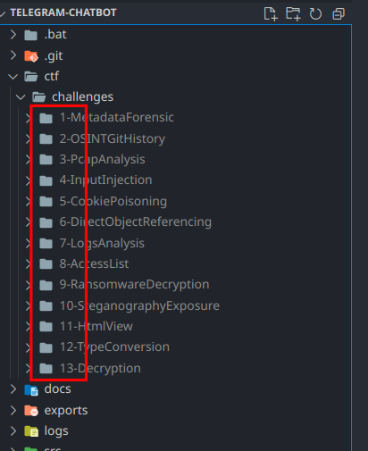

# Table of contents

1. [Quickstart](#1-quickstart-reference)
   - [1.1 Setting up](#11-setting-up):
     - [**setup.py**](#111-setuppy)
     - [Building manually](#112-building-manually)
   - [1.2 Configuring **config.yaml**](#12-configuring-configyaml)
   - [1.3 Adding CTF Challenges](#13-adding-ctf-challenges)
   - [1.4 Running Chatbot](#14-running-the-chatbot)
   - [1.5 Using helper scripts](#15-using-helper-scripts)
2. [States & Stages](#2-states--stages)
   - [2.1 Inbuilt stages](#21-inbuilt-stages):
     - [let_user_choose](#211-letuserchoose)
     - [get_user_input](#212-getuserinput)
     - [get_user_info](#213-getuserinfo)
   - [2.2 Custom stages](#22-creating-a-custom-stage)
3. [CallbackQuery](#3-callbackquery)

<br />

# 1) QUICKSTART REFERENCE

## 1.1) Setting up

<br />

### 1.1.1) `setup.py`:

If you are running **Windows** or **Linux**, you can set up the project and install dependencies using `setup.py`:

```bash
$ cd ${rootDir}

$ python setup.py

Please enter your python keyword:

# Enter your python keyword
# For example use python3 in your system if that points to python 3
```

If setup fails, please refer to [1.1.2) Building manually](#112-building-manually) and follow the steps for where the setup failed.

<br />

### 1.1.2) Building manually:

If you are running any other OS such as **MacOS**, you will have to build the project manually.

1. Go to your project root directory:
   ```bash
   cd ../project_name/
   ```
2. Create the following directories in your root directory:
   - ctf/challenges/
   - exports/
   - logs/
3. Create python virtual environment, `venv`:
   ```bash
   $ python -m venv venv
   ```
4. Install project dependencies into venv:

   ```bash
   # Unix
   $ venv/bin/python -m pip install -r requirements.txt
   # Windows
   $ .\venv\Scripts\python.exe -m pip install -r requirements.txt

   # --

   # You can also activate the virtual environment beforehand:
   $ source venv/bin/activate # Unix
   $ .\venv\Scripts\activate.bat # Windows

   # And then just use pip
   # You can use which pip or Get-Command pip to verify
   $ pip install -r requirements.txt
   ```

5. Create `config.yaml`:

   ```yaml
   # ---------------------------------- RUNTIME --------------------------------- #
   RUNTIME:
     LIVE_MODE: false
     FRESH_START: true

   # -------------------------------- BOT CONFIG -------------------------------- #
   BOT_TOKENS:
     LIVE: BOT_TOKEN
     TEST: BOT_TOKEN

   BOT:
     REMOVE_INLINE_KEYBOARD_MARKUP: True

   # ------------------------------ USER PASSCODES ------------------------------ #
   MAKE_ANONYMOUS: false

   USER_PASSCODES:
     {}
     # START_OF_PASSCODES_MARKER
     # END_OF_PASSCODES_MARKER

   # ------------------------------- ADMIN CHATIDS ------------------------------ #
   ADMIN_CHATIDS: []

   # -------------------------------- LOG CONFIG -------------------------------- #
   LOG_USER_TO_APP_LOGS: false
   ```

<br />

---

<br />

## 1.2) Configuring config.yaml

For this program to run correctly, the `config.yaml` file has to be first configured.

`config.yaml` is similar to an `env` file if you are familiar with that.\
I decided to bundle my the project's secrets, environment variables as well as config values into one file.\
I have done my best to document each value and its signifance below.

```yaml
# ../${rootDir}/config.yaml

# ---------------------------------- RUNTIME --------------------------------- #
RUNTIME:
  LIVE_MODE: false
  FRESH_START: true

# -------------------------------- BOT CONFIG -------------------------------- #
BOT_TOKENS:
  LIVE: BOT_TOKEN
  TEST: BOT_TOKEN

BOT:
  REMOVE_INLINE_KEYBOARD_MARKUP: True

# ------------------------------ USER PASSCODES ------------------------------ #
MAKE_ANONYMOUS: false

USER_PASSCODES:
  # START_OF_PASSCODES_MARKER
  A1234: John Smith
  # END_OF_PASSCODES_MARKER

# ------------------------------- ADMIN CHATIDS ------------------------------ #
ADMIN_CHATIDS: []

# -------------------------------- LOG CONFIG -------------------------------- #
LOG_USER_TO_APP_LOGS: false
```

### config.yaml fields reference:

- **`RUNTIME`**:

  If **RUNTIME:LIVE_MODE** is set to `true` then the bot will use **BOT_TOKENS:LIVE** else it will use **BOT_TOKENS:TEST**.

  If **RUNTIME:FRESH_START** is set to `true` then the bot will clear previous log and user files every time it is restarted.\
   For safety purposes, **RUNTIME:FRESH_START** will be **ignored** if **RUNTIME:LIVE_MODE** is `true`.

- **`BOT_TOKENS`**:

  **BOT_TOKENS:LIVE** is the token to connect to the Telegram Bot used for release day.\
  **BOT_TOKENS:TEST** is the token to connect to the Telegram Bot used during development.

  We have two bot tokens to allow for testing of the bot on a test Telegram bot and only use the actual Telegram bot on the desired day. This prevents misuse or unexpected outcomes of previous users using the bot at a time of testing.\
  You may choose to ignore this feature by leaving `LIVE_MODE` to either `true` or `false` permanently (Note: `FRESH_START` does not work when `LIVE_MODE` is `true` as a safety procedure).

- **`BOT`**:

  If **REMOVE_INLINE_KEYBOARD_MARKUP** is set to `true` then the bot will remove InlineKeyboardMarkup for its previous message everytime an InlineKeyboardButton is pressed (handled through the query.answer callback that is called after the event is triggered). This is to prevent users from using old menu buttons however can cause visual confusion to user due to multiple updates to dislay messages (first Remove keyboard-markup then update message content to new text).

- **`MAKE_ANONYMOUS`**:

  **Note:** This field is only used with [`Stage:Authenticate`](src/stages/authenticate.py). If you are not using the stage, you can ignore this field.

  If set to `true` then the passcodes is used only to allow users access to the bot and not for indentifcation. They will not be prompted of the type or name associated with the passcode.

  If set to `false` then passcodes are also used to identify users. Users will be prompted to confirm that their identity matches the one registered for the passcode.

- **`USER_PASSCODES`**:

  **Note:** This field is only used with [`Stage:Authenticate`](src/stages/authenticate.py). If you are not using the stage, you can ignore this field.

  Each _PASSCODE_ is an entry:

  ```yaml
  PASSCODE:
    - USER NAME
    - USER GROUP
  ```

  _USER GROUP_ can be omitted and will default to "none":

  ```yaml
  PASSCODE: USER NAME
  ```

  Here is an example with more passcodes:

  ```yaml
  # ------------------------------ USER PASSCODES ------------------------------ #
  USER_PASSCODES:
    # START_OF_PASSCODES_MARKER

    #------
    # Generated at 16/05/2022 13:09:13
    # Refer to scripts/generate_passcodes.py for more details.

    T3026: Sonya Anhak # Here we can omit User Group entirely
                    # It will be defaulted to none

    T3026:
    - Derek Eng
    - none # We can also explicitly define User Group to be none

    X4853:
    - Rock Lee
    - member

    E9468:
    - Samantha Tan
    - guest

    E4739:
    - John Smith
    - guest

    #------

    # END_OF_PASSCODES_MARKER
  ```

- **`ADMIN_CHATIDS`**:

  **Note:** This field is only used with [`Stage:Admin`](src/stages/admin.py). If you are not using the stage, you can ignore this field.

  Every user with their chatid here will have access to the Admin Console when using the bot assuming that the Admin stage is in use (look through [admin.py](src/stages/admin.py) for more details).

  To obtain your own chatid, you can run the bot in development mode, and use the bot alone. This ensures the only one user created is yours. Alternatively, you can also follow this [guide](https://www.alphr.com/find-chat-id-telegram/).

  Each _CHATID_ is an entry:

  ```yaml
  ADMIN_CHATIDS:
    - 102391029
  ```

  Here is an example with more chatids:

  ```yaml
  ADMIN_CHATIDS:
    - 1203910239
    - 12032190391
    - 40329103192
  ```

  If you do not wish to have any admin chatids:

  ```yaml
  ADMIN_CHATIDS: []
  ```

- **`LOG_USER_TO_APP_LOGS`**:

  If _LOG_USER_TO_APP_LOGS_ is set to `true` then user logs will be appended as part of the bot logs too.

  Bot log file can be found at: `../${rootDir}/logs/${log_file}.log`\
   User specific log files can be found at: `../${rootDir}/users/${userId}/${userId}.log`

  For more information about **logging** go to [3) Logging](#2-states--stages).

<br />

---

<br />

## 1.3) Adding CTF Challenges

The default directory for CTF challenges is at `${rootDir}/ctf/challenges`.

Each challenge is a subdirectory with the following name format:

    {NUMBER}-CHALLENGE_NAME



The number preceeding the challenge name determines the **order** of display of challenges to the user on Telegram.


<br />\
**Each** challenge directory is expected to contain a `challenge.yaml` file of the following format:


```yaml
# ../${rootDir}/ctf/challenges/1-challenge/challenge.yaml
description: "Can you find the flag in this file?"
additional_info: null
answer: "flag@answer"

points: 40
difficulty: 1

multiple_choices: null
one_try: false
time_based: null

hints: []

files: []
```

### challenge.yaml fields reference:

- **`description`** : Required [string]

  Challenge text displayed when viewing challenge.

  ```yaml
  description: "Can you find the flag in this file?"
  ```

- **`additional_info`** : Optional [string, null]

  Additional info displayed when viewing the challenge.\
  It will be displayed under the `Notes:` section of the challenge view.

  If you wish to have additional information displayed:

  ```yaml
  additional_info: "Please do not execute the files from this challenge with admin rights."
  ```

  Else:

  ```yaml
  additional_info: null
  ```

- **`answer`** : Required [string]

  The accepted answer of the challenge. Casing will be ignored when validating users answers.\
  Please ensure the answer contains only the following characters: `alphanumeric _ @`.

  ```yaml
  # If answer is preceeded by "flag@..." then a warning will be given
  # to user when their answer does not begin with flag@.
  answer: "flag@answer"
  ```

- **`points`** : Required [integer]

  The total score for the challenge before deductions. This should reflect the difficulty of the challenge.

  ```yaml
  points: 40
  ```

- **`difficulty`** : Required [integer]

  The difficulty rating for the challenge. This will be represented by a star icon '✯' per difficulty.

  To display difficulty rating of `X`:

  ```yaml
  difficulty: X
  ```

  

  If you wish to hide the difficulty rating of the challenge:

  ```yaml
  difficulty: 0
  ```

  

- **`multiple_choices`** : Optional [list, null]

  Whether your challenge is a mutliple choice challenge.

  If it, you have to provide the possible OPTIONS:

  ```yaml
  # Points is calculated by:
  #     challenge_points_before_hints_deduction / number_of_attempts
  # Ensure that the correct option matches the CHALLENGE:answer (answer checking ignores casing).
  # You can have as many options as you want.
  # Options will be displayed as rows of 2 when possible.
  multiple_choices:
    - Option One
    - Option Two
    - Option Three
    - Option Four
  ```

  Else:

  ```yaml
  multiple_choices: null
  ```

- **`one_try`** : Required [bool]

  Whether to only allow one attempt for the challenge.

  If you wish to only allow the user to attempt the challenge once:

  ```yaml
  one_try: true
  ```

  Else:

  ```yaml
  one_try: false
  ```

- **`time_based`** : Optional [integer, null]

  Whether to calculate the score based on time taken to complete challenge.

  If you wish to set the time limit to 300 `seconds`:

  ```yaml
  # Points is calculated by:
  #     (max(time_taken, time_based) / time_based) * challenge_points_after_hints_deduction
  # If time taken to complete challenge exceeds time_based, then a score of 0 is awarded.
  time_based: 300
  ```

  If you don't wish to enable this:

  ```yaml
  time_based: null
  ```

- **`hints`** : Required [list]

  The list of hints provided for your challenge.

  ```yaml
  hints:
    - text: "Hint here"
      deduction: 5
  ```

  You can have as many hints as needed:

  ```yaml
  hints:
    - text: "Hint One"
      deduction: 5
    - text: "Hint Two"
      deduction: 5
    - text: "Hint Three"
      deduction: 5
  ```

  Or none at all:

  ```yaml
  hints: []
  ```

- **`files`** : Required [list]

  The list of file links to download the files needed for your challenge.

  ```yaml
  files:
    - "https://url-to-file.com"
  ```

  You can have as many file links as needed:

  ```yaml
  files:
    - "https://first-file.com"
    - "https://second-file.com"
    - "https://third-file.com"
  ```

  Or none at all:

  ```yaml
  files: []
  ```

<br />

---

<br />

## 1.4) Running the Chatbot

1. Ensure [`config.yaml`](config.yaml) is configured correctly.

   Please refer to [this](#12-configuring-configyaml) if you have not done so.

2. Run the project.

   The entry point of the chatbot is `main.py`.

   With `venv` activated for your terminal session:

   - Activating venv:

     ```bash
     # cd ${rootDir}

     # Linux:
     $ source venv/bin/activate

     #Windows:
     $ venv\Scripts\activate.bat
     ```

   - Running main.py:

     ```bash
     # cd ${rootDir}

     # Linux:
     $(venv) python main.py

     # Windows:
     $(venv) python .\main.py
     ```

   Or if you don't wish or can't get venv activated:

   ```bash
   # cd ${rootDir}

   # Linux:
   $ venv/bin/python main.py

   # Windows:
   $ .\venv\Scripts\python.exe .\main.py
   ```

<br />

---

<br />

## 1.5) Using helper scripts

`Warning: Please refer and read through what each script does before using it.`\
`Some scripts can cause irrevisble changes to your project.`

Helper scripts are scripts that are designed to be used either before, during or after a session of [running](#14-running-the-chatbot) the Telegram Bot.

They help to make your life easier by executing common tasks or tasks that are repetitive and can be automated or even help you out in testing and debugging of the bot.

Scripts that are ran before a session include:

- [`create_fake_users`](scripts/create_fake_users.py)
- [`create_placeholder_challenges`](scripts/create_placeholder_challenges.py)
- [`generate_passcodes`](scripts/generate_passcodes.py)
- [`reset_project`](scripts/reset_project.py)

Scripts that are ran during a session include:

- [`leaderboard`](scripts/leaderboard.py)

Scripts that are ran after a session include:

- [`ban_all_users`](scripts/ban_all_users.py)
- [`notify_winners`](scripts/notify_winners.py)
- [`export_logs`](scripts/export_logs.py)

<br />

Below is a brief description of what each script does and how to use them.

- [`ban_all_users`](scripts/ban_all_users.py):

  This script will get all the existing users found in the [users directory](users/) and add their chatids to the [banned_users.yaml](users/banned_users.yaml) file. It will NOT DELETE their files. If you wish to do that, you will have to do it manually or use the [`reset_project`](scripts/reset_project.py) helper script.

  It is useful for preventing users from an earlier session from joining in on a later session.

  Usage:

  ```bash
  $ python scripts/ban_all_users.py
  ```

- [`create_fake_users`](scripts/create_fake_users.py):

  This script will generate fake users that will "attempt" and "complete" some of the existing CTF challenges.

  It is useful for populating the leaderboard during testing and also for creating test export log files (more on that below).

  Currently the fake users are only configured to attempt CTF Challenges and not any other stages such as [Guardian](src/stages/guardian.py).

  **Warning**: This script **WILL DELETE ALL** current user files found in the [${rootDir}/users/](users/).

  Arguments:

  ```
  $ python scripts/create_fake_users.py -h
  usage: create_fake_users.py [-h] [-n N] [-c C]

  optional arguments:
    -h, --help  show this help message and exit
    -n N        Number of users to generate. Max is 26. If set to 0 then max will be taken.
    -c C        Number of challenges to attempt per user.
  ```

  Usage:

  ```bash
  # Create 20 fake users each attempting MIN 4 challenges
  $ python scripts/create_fake_users.py -n 20 -c 4
  ```

  ```bash
  # Create MAX (24) fake users
  $ python scripts/create_fake_users.py -n 0
  ```

  `-n` argument is for the number of fake users to create. It is capped at 26.

  `-c` argument is for the number of challenges to attempt per user. It will be capped at the number of current existing CTF challenges.

- [`create_placeholder_challenges`](scripts/create_placeholder_challenges.py):

  This script will create placeholder challenges either based on the in-built challenge.yaml template or using a provided file.

  It is useful for testing purposes and removing the need to update challenges manually everytime when testing a new feature.

  **Warning**: This script **WILL DELETE ALL** current challenges found in the [${rootDir}/ctf/challenges](ctf/challenges/).

  Arguments:

  ```
  $ python scripts/create_placeholder_challenges.py -h
  usage: create_placeholder_challenges.py [-h] [-i I] [-n N]

  optional arguments:
    -h, --help  show this help message and exit
    -i I        challenge.yaml input file as template
    -n N        Number of challenges to generate. If omitted, defaults to 4.
  ```

  Usage:

  ```bash
  # Create 10 placeholder challenges
  $ python scripts/create_placeholder_challenges.py -n 10
  ```

  ```bash
  # Create 10 placeholder challenges from custom template file
  $ python scripts/create_placeholder_challenges.py -n 10 -i path/to/challenge.yaml
  ```

  `-i` argument is for providing a custom challenge.yaml to use as template when creating the placeholder challenges.

  `-n` argument is for the number of placeholder challenges to create.

- [`export_logs`](scripts/export_logs.py):

  This script will generate a [CSV](https://en.wikipedia.org/wiki/Comma-separated_values) file that can be imported into Excel for visualization of users data.

  It will only extract from the user logs, actions that are relevant to their scoring such as:

  - Viewing of hints
  - Attempting the challenge
  - Completing the challenge

  To include custom data fields such as username etc, modify the `RELEVANT_DATA_FIELDS` found in the script:

  ```python
  RELEVANT_DATA_FIELDS = {
    # "data-field-label" : [constructor, default_value]
    "name": [str, "anonymous"],
    "username": [str, ""],
    "group": [str, "no-group"]
  }
  ```

  It will try and get the data_field from `userdata` (user.yaml) and if not found will use the default value provided.

  Arguments:

  ```
  $ python scripts/export_logs.py -h
  usage: export_logs.py [-h] [-o O] [-u U] [-g G]

  optional arguments:
    -h, --help  show this help message and exit
    -o O        File name to output exported logs to. Defaults to exported_logs.
    -u U        Specify a chatid to export logs from.
    -g G        Specify a group to export logs from.
  ```

  Usage:

  ```bash
  $ python scripts/export_logs.py -o "example_export"
  ```

  `-o` argument is for the exported csv filename. The ".csv" file extension should not be included in the argument

  `-u` argument is for if you want to export logs from only one user (provide the chatid here).

  `-g` argument is for if you want to export logs from only one user group (provide group name here).

- [`generate_passcodes`](scripts/generate_passcodes.py):

  This script will generate a list of passcodes from a list of user (names) and append the passcodes into [config.yaml](config.yaml).

  This script is useful for getting unique passcodes for a list of users in bulk as doing it by-hand is time consuming and prone to mistakes (might have duplicate passcodes).

  **Note**: These passcodes are used by the stage [Authenticate](src/stages/authenticate.py) to grant users access to the bot hence it is assumed that the stage is in use for the bot session.

  Arguments:

  ```
  $ python scripts/generate_passcodes.py -h
  usage: generate_passcodes.py [-h] -i I

  optional arguments:
    -h, --help  show this help message and exit
    -i I        Input file with users list.
  ```

  Usage:

  ```bash
  $ python scripts/generate_passcodes.py -i path/to/userlist.txt
  ```

  `-i` argument is the input file with the names and groups of users to be added.

- [`leaderboard`](scripts/leaderboard.py):

  This script will read [user files](users) and generate a leaderboard rankings from their scores. It will output the rankings to two files:

  - ../leaderboard.json

    This is used by Chatbot-Leaderboard Website hence if you are running Chatbot-Leaderboard ensure that you provide a path to the webpage root directory (see Arguments and Usage below).

    If you do not have the website enabled, you can pass the disable-webpage flag to not create this file (see Arguments and Usage).

  - [${rootDir}/exports](exports/)/exported_leaderboard.csv

    This is a `CSV` file that you can use to view in realtime the scoring and rankings of the current users. The list is ordered and be configured to include any other relevant userdata collected or generated (such as email etc).

  While the stage [CTF](src/stages/ctf.py) does have an inbuilt leaderboard functionality, this allows you have a second independent leaderboard running on a separate thread.

  Arguments:

  ```
  $ python scripts/leaderboard.py -h
  usage: leaderboard.py [-h] [-n N] [-o O] [--disable_webpage_leaderboard_file DISABLE_WEBPAGE_LEADERBOARD_FILE]

  options:
    -h, --help            show this help message and exit
    -n N                  Limit leaderboard up to a certain placing. Defaults to no limit (all users will be ranked).
    -o O                  Path to output the leaderboard JSON file to. Defaults to root directory: ${rootDir} / leaderboard.json
    --disable_webpage_leaderboard_file DISABLE_WEBPAGE_LEADERBOARD_FILE
                          If set to any value, the leaderboard.json file will not be generated.
  ```

  Usage:

  ```bash
  $ python scripts/leaderboard.py -o ../../Chatbot-Leaderboard/
  ```

  ```
  # Limit number of displayed top users to X
  $ $ python scripts/leaderboard.py -o ../../Chatbot-Leaderboard/ -n X
  ```

  ```bash
  # Without webpage enabled:
  $ python scripts/leaderboard.py --disable_webpage_leaderboard_file true
  ```

  `-n` argument is the number of top users to display. If not set, it will display all users.

  `-o` argument is where to create the output `leaderboard.json` to.

  `--disable_webpage_leaderboard_file` argument is whether to enable the webpage. If set, then `leaderboard.json` will not be created.

- [`notify_winners`](scripts/notify_winners.py).
  This script will notify the top 3 users (considers users and not placings meaning that users who are tied may not be considered, first to attain score basis) via a message sent through the bot. The message will not be successfully delivered if the user has stopped and blocked the bot after use.

  This script is useful if you do not have any means of contact to the users such as their phone numbers or email addresses as it allows you to contact them via the bot using only their chatid.

  Usage:

  ```bash
  $ python scripts/notify_winners.py
  ```

- [`reset_project`](scripts/reset_project.py):

  This script will delete any existing log and user files.

  This script is useful for resetting the state of the bot between runs especailly during testing phases.

  **Warning**: This script **WILL DELETE ALL** user files found in the [users directory](users/) and log files found in the [logs directory](logs/).

  Usage:

  ```bash
  $ python scripts/reset_project.py
  ```

---

<br />

# 2) STATES & STAGES

Throughout this project, you will see a lot of references to stages and states.

Simply said, a `state` is the smallest unit of "building block" while a `stage` is a group of states (or nested stages even) with its inner functionality abstracted away for either reduced code duplication or means of organization.

With the use of stages you can reuse common functionality between stages, see [in-built stages](#21-inbuilt-stages).\
You can also create custom stages to have unique functionality, see [custom stages](src/stages/).

Below is a more in-depth description however you might find it still insufficient. It is best to dive in and [try it yourself](#22-creating-a-custom-stage).

- A `state` is a condition of outcome that the `User` is in.

  A state can identified as a unique `integer` hence the user can only be ONE state at any given time.\
  The actual integral value of the state has no meaning other than to signify the sequence of instantiation (order of which we defined the states).

  When creating a state, we define a list of `callback handlers` to handle the input provided by the user while they are in the state (USERSTATE) and decide on an outcome.
  There are two types of callback handlers:

  1. `CallbackQueryHandler` - called when user presses a given `InlineKeyboardButton` \
     This handler is specific to the button meaning that the `pattern` of the CallbackQueryHandler must match the `callback_data` of the InlineKeyboardButton.

     Each `CallbackQueryHandler` has a `CallbackQuery` which needs to be answered by the handler callback:

     ```python
     def callback(update: Update, context: CallbackContext) -> USERSTATE:
       query = update.callback_query
       if query:
           query.answer()
     ```

     It is good practice to always check if there is a CallbackQuery that can be answered and answer it.

     Only time you can omit this check is if you are sure that the callback handler cannot be called by a CallbackQueryHandler update.

  2. `MessageHandler` - called when user sends a message \
     This handler is non-specific and will be called for every message the user sends. Proper steps must be taken to to filter repeated user input (debounce check etc..).

- A `stage` is essentially a collection of states with added functionality to allow the creation of complex logic. Stages can also be nested within stages allowing for the use of inbuilt stages in your custom stages.

  Each stage has:

  1. An `__init__` dunder method.

     You can initialize any additional attributes your stage needs here.\
     Remember to still call the abstract class `Stage`:`__init__` as it handles initializing core attributes:

     - bot : Bot
     - user_manager : UserManager

     - stage_id : str
     - next_stage_id : str

     - states = {}

     ```python
     def __init__(self, stage_id: str, next_stage_id: str, bot):
        self.some_attribute = []
        self.other_attribute = {}
        super().__init__(stage_id, next_stage_id, bot)
     ```

  2. A `setup` method.

     ```python
     def setup(self) -> None:
        self.init_users_data()

        self.states = {
            "SOME_STATE": [
                CallbackQueryHandler(callback0, pattern=f"^some_state_0S"),
                CallbackQueryHandler(callback1, pattern=f"^some_state_1$")
            ],
            "SOME_OTHER_STATE": [
                MessageHandler(Filters.all, callback2)
            ]
        }

        self.bot.register_stage(self)

        # USERSTATES
        self.SOME_STATE, self.SOME_OTHER_STATE = self.unpacked_states

        self.INPUT_FOO_STAGE = self.bot.get_user_input(
            stage_id="input_foo",
            input_text="Please enter something:",
            input_handler=callback3,
            exitable=True
        )
     ```

     `self.states` is a dictionary of states that the stage can be in.\
      Each state has callback handlers to handle any action done in that state.

     ```python
     self.states = {
         "STATE_NAME" : [
              CallbackQueryHandler(callback_function, pattern=state_pattern),
              MessageHandler(Filters.all, callback_function)
         ],
         ...
     }
     ```

     After the stage has been registered,

     ```python
     self.bot.register_stage(self)
     ```

     You can retrieve the registered `USERSTATES` by using:

     ```python
     self.SOME_STATE, self.SOME_OTHER_STATE = self.unpack_states
     ```

     Note that order of states unpacked is the same as the order when initializing `self.states`.

     The type of each of the state is `USERSTATE`:

     ```python
     self.SOME_STATE : USERSTATE
     self.SOME_OTHER_STATE : USERSTATE
     ```

     You can then set the state of the bot by returning the respective `USERSTATE` in your callback handlers:

     ```python

     def callback(self, update: Update, context: CallbackContext):
        query = update.callback_query
        if query:
            query.answer()

        # do something here
        # maybe:
        #
        # self.bot.edit_or_reply_message(
        #   update, context,
        #   text="You are in some state now..",
        #   reply_markup=...)

        return self.SOME_STATE

     ```

  3. An `init_users_data` method.

     You are required to call the `super-class init_users_data` method as well.\
     This is so as the super-class will set a hidden property `_users_data_initialized` to indicate that the stage has its user_data initialized.

     ```python
     def init_users_data(self) -> None:
       self.user_manager.add_data_field("some-data", "")
       return super().init_users_data()
     ```

  4. A `stage_entry` method.

     This is the function called when loading the stage from another stage in `bot.proceed_next_stage`.\
     You may include any logic to decide what happens on entry here.

     Make sure to check and answer the `callback_query` if applicable.

     ```python
     def stage_entry(self, update: Update, context: CallbackContext) -> USERSTATE:
        query = update.callback_query
        if query:
            query.answer()

        return self.load_menu(update, context)
     ```

  5. A `stage_exit` function.

     This is where you can have wrap-up logic for your stage before proceeding to the next stage.\
     If you stage_exit has `default behavior`, then you may just call the super-class stage_exit method instead.

     ```python
     def stage_exit(self, update: Update, context: CallbackContext) -> USERSTATE:
        query = update.callback_query
        if query:
            query.answer()

        return self.bot.proceed_next_stage(
            current_stage_id=self.stage_id,
            next_stage_id=self.next_stage_id,
            update=update, context=context
        )
     ```

     Equivalent to:

     ```python
     def stage_exit(self, update: Update, context: CallbackContext) -> USERSTATE:
        return super().stage_exit(update, context)
     ```

     Exiting the stage from within itself,

     ```python
     def some_state_handler(self, update: Update, context: CallbackContext) -> USERSTATE:
         query = update.callback_query
         if query:
             query.answer()

         return self.stage_exit(update, context)
     ```

  See more practical examples [here](examples/stages/):

  - [ExampleStage](examples/stages/example_stage.py): Contains a nested [`GetUserInput`](#212-getuserinput)
  - [FavoriteFruits](examples/stages/stage_with_let_user_choose.py): Contains a nested [`LetUserChoose`](#211-letuserchoose) stage
  - [EchoTen](examples/stages//stage_with_get_user_input.py): Contains a nested [`GetUserInput`](#212-getuserinput) stage

---

<br />

## 2.1) Inbuilt stages

<br />

### 2.1.1) **LetUserChoose**

Presents a variable number of choices to the user. The choices are in the form of buttons (ReplyMarkupButton).

The code below shows a brief implementation example for the stage.

You may also view more examples here:

- [let_user_choose: Complete Basic Implementation](examples/let_user_choose.py)
- [let_user_choose: Dynamic Implementation](examples/let_user_choose2.py)
- [let_user_choose: Persistent Data Implementation](examples/let_user_choose3.py)
- [Custom Stage + let_user_choose: With Persistent Data](examples/stages/stage_with_let_user_choose.py)

```python
bot: Bot = Bot()
bot.init(token=BOT_TOKEN,
         logger=logger,
         config=CONFIG)


STAGE_FAV_FRUIT = "choose_favorite_fruit"


def handle_user_choice(choice_selected: str, update: Update, context: CallbackContext) -> USERSTATE:
    print("Choice selected was:", choice_selected)
    return bot.proceed_next_stage(
        current_stage_id=STAGE_FAV_FRUIT,
        next_stage_id=NEXT_STAGE_ID,
        update=update, context=context
    )


choose_fav_fruit_stage : Stage = bot.let_user_choose(
    stage_id=STAGE_FAV_FRUIT,
    choice_text="Which is your favorite fruit?",
    choices=[
        {
            "text": "🍎",
            "callback": lambda update, context: handle_user_choice("apple", update, context)
        },
        {
            "text": "🍐",
            "callback": lambda update, context: handle_user_choice("pear", update, context)
        },
        {
            "text": "🍊",
            "callback": lambda update, context: handle_user_choice("orange", update, context)
        },
        {
            "text": "🍇",
            "callback": lambda update, context: handle_user_choice("grape", update, context)
        },
    ],
    choices_per_row=2
)

assert choose_fav_fruit_stage.stage_id == STAGE_FAV_FRUIT


# --
# Proceeding to the stage:
def some_state_in_a_stage(self: Stage, update: Update, context: CallbackContext) -> USERSTATE:
    query = update.callback_query
    if query:
        query.answer()

    return bot.proceed_next_stage(
        current_stage_id=self.stage_id,
        next_stage_id=STAGE_FAV_FRUIT,
        update=update, context=context
    )
```

<br />

### 2.1.2) **GetUserInput**

Presents an input field to the user. Input is captured through the next valid message sent from input prompt.

Invalid input types such stickers, GIFs and file uploads are ignored. Incorrect input forms such as editing previously sent messages are also disregarded.

You may also view more examples here:

- [get_user_input: Complete Basic Implementation](examples/get_user_input.py)
- [Custom Stage + get_user_input](examples/stages//stage_with_get_user_input.py)

```python
bot: Bot = Bot()
bot.init(token=BOT_TOKEN,
         logger=logger,
         config=CONFIG)


STAGE_EXAMPLE_ANY_INPUT = "input_example_any"


def callback(input_given: str, update: Update, context: CallbackContext) -> USERSTATE:
    print("Input given was:", input_given)
    return Bot.proceed_next_stage(
        current_stage_id=STAGE_EXAMPLE_ANY_INPUT,
        next_stage_id=NEXT_STAGE_ID,
        update=update, context=context
    )


input_example_any_stage: Stage = bot.get_user_input(
    stage_id=STAGE_EXAMPLE_ANY_INPUT,
    input_text="Please input your \_\_\_\_:",
    input_handler=callback,
    exitable=True
)

assert input_example_any_stage.stage_id == STAGE_EXAMPLE_ANY_INPUT


# --
# Proceeding to the stage:
def some_state_in_a_stage(self: Stage, update: Update, context: CallbackContext) -> USERSTATE:
    query = update.callback_query
    if query:
        query.answer()

    return bot.proceed_next_stage(
        current_stage_id=self.stage_id,
        next_stage_id=STAGE_EXAMPLE_ANY_INPUT,
        update=update, context=context
    )
```

<br />

### 2.1.3) **GetUserInfo**

Similar to `GetUserInput` except that the input is a user information (string) and is stored globally in the userdata. No additional logic implementation is required.

You may also view more examples here:

- [get_user_info: Complete Basic Implementation](examples/get_user_info.py)
- [get_user_info: Using a realistic data label (Email)](examples/get_user_info2.py)

```python
bot: Bot = Bot()
bot.init(token=BOT_TOKEN,
         logger=logger,
         config=CONFIG)

STAGE_COLLECT_PHONE_NUMBER = "info_collect_phone_number"


def format_number_input(input_str: Union[str, bool]):
    if input_str is True:
        return "91234567"
    else:
        if input_str.find("+65") >= 0:
            input_str = input_str[3:]
            input_str = utils.format_input_str(input_str, False, "0123456789")
            return input_str if (
                len(input_str) == 8 and "689".find(input_str[0]) >= 0
            ) else False


info_collect_phone_number_stage = bot.get_user_info(
    stage_id=STAGE_COLLECT_PHONE_NUMBER,
    next_stage_id=NEXT_STAGE_ID,
    data_label="phone number",
    input_formatter=format_number_input,
    additional_text="We will not use this to contact you.",
    use_last_saved=True,
    allow_update=True
)

assert info_collect_phone_number_stage.stage_id == STAGE_COLLECT_PHONE_NUMBER


# --
# Proceeding to the stage: (for get_user_info this is usually done at the start of the chatbot flow path)
def some_state_in_a_stage(self: Stage, update: Update, context: CallbackContext) -> USERSTATE:
    query = update.callback_query
    if query:
        query.answer()

    return bot.proceed_next_stage(
        current_stage_id=self.stage_id,
        next_stage_id=STAGE_COLLECT_PHONE_NUMBER,
        update=update, context=context
    )
```

---

<br />

## 2.2) Creating a custom stage

<br />

### Prequisites:

---

**⚠️ NOTE:** Unfortunately at the time of writing this documentation, the [`python-telegram-bot`](https://github.com/python-telegram-bot/python-telegram-bot) had just released their lastest version `V20.X`. The new changes are not compatible with the current state of this project. Manual updating is required if you wish to upgrade to V20.X.\
You can refer to the transition guides listed on their wiki [here](https://github.com/python-telegram-bot/python-telegram-bot/wiki/Transition-guide-to-Version-20.0).

**⚠️ NOTE:** The example guides listed below have been updated for V20.X of `python-telegram-bot`. To view its older version, please use [`githistory.xyz`](https://githistory.xyz/).

---

Creating custom stages will require you to have knowledge about working with [`python-telegram-bot`](https://github.com/python-telegram-bot/python-telegram-bot/)

Do read more and understand the [examples](https://github.com/python-telegram-bot/python-telegram-bot/tree/master/examples) before continuing.\
The relevant examples are: [ConversationBot](https://github.com/python-telegram-bot/python-telegram-bot/blob/master/examples/conversationbot.py) and [ConversationBot2](https://github.com/python-telegram-bot/python-telegram-bot/blob/master/examples/conversationbot2.py).

In our application, `USERSTATE` is a created data-type with an integral value to signify the state of the CallbackHandler.\
`GENDER, PHOTO, LOCATION, BIO ` (found in [ConversationBot](https://github.com/python-telegram-bot/python-telegram-bot/blob/master/examples/conversationbot.py) are examples of USERSTATE in our application.

<br />

### Basic stage (`BasicStage`):

- Basic menu demonstration

[examples/stages/basic_stage.py](examples/stages/basic_stage.py)

<br />

### Custom stage (`Example`):

- Menu with more features
- Persistent data
- Uses user input

[examples/stages/example_stage.py](examples/stages/example_stage.py)

<br />

### Using custom stage:

[main.py](main.py)

Note: For the purposes of this code example, we will take it that the custom stage python file is under `src/stages/`.

```python
#!/usr/bin/env python3
import sys
sys.path.append("src")

import logging
import os

from bot import Bot
from user import UserManager
import utils.utils as utils
from utils.log import Log

from stages.example_stage import Example

LOG_FILE = os.path.join("logs", f"main.log")

CONFIG = utils.load_yaml_file(os.path.join("config.yaml"))
assert CONFIG, "Failed to load config.yaml. Fatal error, please remedy."\
    "\n\nLikely an invalid format."

LIVE_MODE = CONFIG["RUNTIME"]["LIVE_MODE"]
FRESH_START = CONFIG["RUNTIME"]["FRESH_START"] if not LIVE_MODE else False
BOT_TOKEN = CONFIG["BOT_TOKENS"]["LIVE"] if LIVE_MODE else CONFIG["BOT_TOKENS"]["TEST"]


def main():
    setup()

    logger = Log(
        name=__name__,
        stream_handle=sys.stdout,
        file_handle=LOG_FILE,
        log_level=logging.DEBUG
    )

    user_manager = UserManager()
    user_manager.init(
        logger=logger,
        log_user_logs_to_app_logs=("LOG_USER_TO_APP_LOGS" in CONFIG
                                   and CONFIG["LOG_USER_TO_APP_LOGS"]))

    bot = Bot()
    bot.init(token=BOT_TOKEN,
             logger=logger,
             config=CONFIG)


    STAGE_EXAMPLE = "example"
    STAGE_END = "end"

    # ------------------------------ Stage: example ------------------------------ #
    example: Example = Example(
        stage_id=STAGE_EXAMPLE,
        next_stage_id=STAGE_END,
        bot=bot
    )
    example.setup()
    bot.set_first_stage(STAGE_EXAMPLE)
    # ---------------------------------------------------------------------------- #

    # -------------------------------- Stage: end -------------------------------- #
    bot.make_end_stage(
        stage_id=STAGE_END,
        goodbye_message="You have exited the conversation. \n\nUse /start to begin a new one.",
        reply_message=True
    )
    # ---------------------------------------------------------------------------- #

    # Start Bot
    bot.start(live_mode=LIVE_MODE)


def setup():
    utils.get_dir_or_create(os.path.join("logs"))
    if FRESH_START:
        # Remove runtime files (logs, users, etc)
        pass


if __name__ == "__main__":
    main()
```

<br />

# 3) CallbackQuery:

Any `CallbackQueryHandler` will have a `CallbackQuery` attribute as part of its `Update`.

Ensure that you answer it the query. If you are unsure whether the action before it contains a callbackquery,

```python
def callback_handler(update: Update, context: CallbackContext) -> USERSTATE:
  query: CallbackQuery = update.callback_query
  if query:
    query.answer()
```

The `@CallbackQuery.answer` method has been over-ridden. You can see the implementation details in [bot.py](src/bot.py) as part of the `@Bot.init` method.

The new method now accepts two new parameters:

- keep_message: `any string (empty string too)` or `True` or `False`
- do_nothing: `True` or `False`

If `do_nothing` is `True`, then all changes below are ignored and nothing happens.

If `keep_message` is `True`, then the previous message remains unchanged but any `reply_markup` is removed (for example any `InlineKeybaordButtonMarkup`).

If `keep_message` is `False`, then the previous message is replaced with a placeholder text `"💭 Loading..."` and any `reply_markup` is also removed.

If `keep_message` is a `non-empty string`, then the previous message is replaced with the non-empty string and any `reply_markup` is also removed.

If `keep_message` is an `empty string`, then the previous message is deleted completely.

Example of usage:

1. Have the default "💭 Loading..." transition on update:

   ```python
   def callback_handler(update: Update, context: CallbackContext) -> USERSTATE:
     query: CallbackQuery = update.callback_query
     if query:
       query.answer()
   ```

2. Delete any previous message:

   ```python
   def callback_handler(update: Update, context: CallbackContext) -> USERSTATE:
     query: CallbackQuery = update.callback_query
     if query:
       query.answer(keep_message="")
   ```

3. Have a custom transition message on update:

   ```python
   def callback_handler(update: Update, context: CallbackContext) -> USERSTATE:
     query: CallbackQuery = update.callback_query
     if query:
       query.answer(keep_message="Custom loading message here")
   ```

4. No transition, just remove any `reply_markup`:

   ```python
   def callback_handler(update: Update, context: CallbackContext) -> USERSTATE:
     query: CallbackQuery = update.callback_query
     if query:
       query.answer(keep_message=True)
   ```

5. No change at all:

   ```python
   def callback_handler(update: Update, context: CallbackContext) -> USERSTATE:
     query: CallbackQuery = update.callback_query
     if query:
       query.answer(do_nothing=True)
   ```

<br />

If you need a more relevant example, you can refer to [`let_user_choose4`](examples/let_user_choose4.py).
